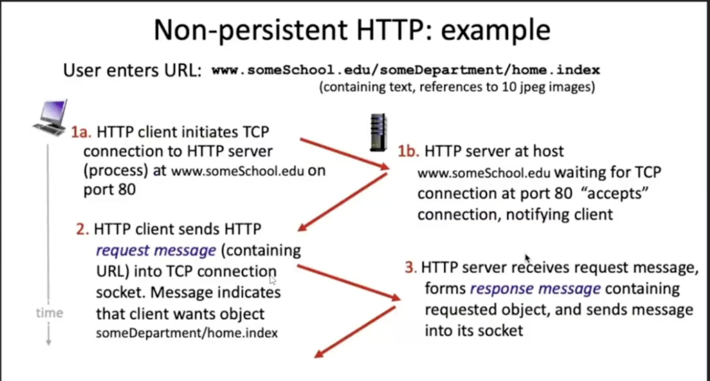
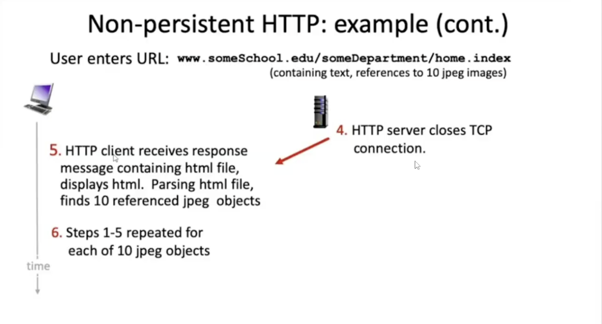

HTTP overview

# HTTP Stakeholders:

- client : browser that requests, receives (using HTTP protocols) and "displays" Web Objects

- server : Web server sends (using http protocol) objects in response to requests,

# HTTP uses TCP 
- client initiates TCP connection (create socket) to server, port (example in here: ) 80     
- server accepts TCP connection from client
- HTTP messages (application layer protocol messages) exchanged between browser (HTTP client) and Web server (HTTP Server)
- TCP Connection closed\

# HTTP is "stateless"
- server maintains no information about past client requests
    aside:
    protocols that maintain "state" are complex
    - past history (state) must be maintained
    - if server/client crashes, their views of "state" may be
      inconsistent, must be reconciled

HTTP is persistent nowadays, but long ago it's not persistent 

